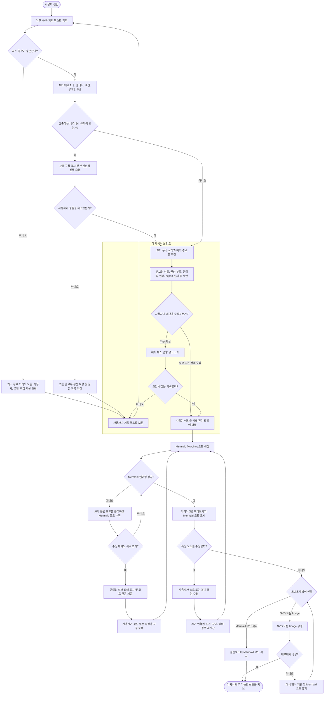

# AI User Flow Planner PRD

## Problem Statement

Early-stage founders, product planners, developers, and product teams often convert rough MVP ideas into implementation work before the user flow is logically complete. Planning documents tend to describe only the happy path, leaving unclear auth rules, missing error states, contradictory requirements, and unmodeled multi-persona interactions. These gaps create rework during API design, QA planning, and stakeholder review.

This product is an AI planning partner that parses incomplete MVP text, identifies missing business logic, recommends edge cases, and generates a development-ready Mermaid user flow.

## Evidence

- User-provided problem: planners often miss exception paths such as onboarding abandonment, data sync failure, Mermaid rendering failure, and contradictory business rules.
- User-provided alternatives: Whimsical AI, Miro AI, Eraser.io, ChatGPT, and Claude can generate diagrams, but the stated gap is domain-aware business logic validation rather than visual brainstorming alone.
- Market scan, April 27, 2026:
  - Whimsical AI supports generation of flowcharts, mind maps, sticky notes, and sequence diagrams from prompts.
  - Miro AI supports diagram and mind map generation from descriptions and provides AI-assisted diagramming workflows.
  - Eraser AI generates diagram-as-code and supports further editing through prompts.
- Assumption: Current AI diagram tools optimize for speed and visual creation, while PM and engineering teams need stronger scenario completeness, state transition rigor, and exception handling.

## Proposed Solution

Build an MVP web experience where a user enters rough product planning text, receives AI-detected logic gaps and edge cases, accepts or rejects recommendations, and generates Mermaid code plus a rendered diagram. The system validates Mermaid syntax, attempts self-correction when rendering fails, and highlights unresolved contradictions before export.

## Key Hypothesis

If product teams can turn incomplete MVP notes into logically checked Mermaid flows with explicit exception paths, then they will reduce planning ambiguity and downstream rework compared with using generic AI diagram generation or manual diagramming tools.

## What We Are NOT Building

- Real-time multiplayer whiteboard collaboration.
- Full project management, Jira sync, or task tracking.
- Payment, billing, or enterprise admin controls in MVP.
- General-purpose canvas editor comparable to Miro or Whimsical.
- Automatic implementation of backend APIs from diagrams.
- Unlimited diagram types. MVP focuses on Mermaid flowcharts first, with sequence diagrams as a later expansion.

## Success Metrics

- Activation: 60% of first-time users generate a valid Mermaid flow from pasted planning text.
- Quality: 80% of generated flows include at least three relevant exception paths.
- Reliability: 95% of Mermaid outputs render successfully after at most one self-correction attempt.
- Usefulness: 50% of users copy Mermaid code or export SVG/Image after generation.
- Rework proxy: Product or engineering users report that generated edge cases uncover at least one missing requirement in 40% of reviewed sessions.

## Open Questions

- Should MVP support authenticated accounts, or start as a session-only tool?
- Should accepted and rejected edge-case suggestions be persisted for future refinement?
- Which LLM provider and model should be used for structured planning output?
- Should Mermaid rendering happen only client-side, or should the backend also validate syntax?
- What is the minimum viable input length and required fields for reliable generation?
- Should output include only flowcharts at launch, or also sequence diagrams for engineer users?

## Users & Context

### Primary Persona: Early Founder or Product Planner

- Job: Turn raw product ideas into a shareable flow quickly.
- Pain: Does not know which exception cases or business rules are missing.
- Success: Gets a clear flowchart with assumptions, decision points, and exportable Mermaid code.

### Secondary Persona: Developer or Architect

- Job: Identify system states, API boundaries, and failure cases before implementation.
- Pain: Text requirements are ambiguous or internally inconsistent.
- Success: Receives a flow that separates user action, AI/system processing, renderer validation, and export state.

### Secondary Persona: PM or PO in Product Team

- Job: Align stakeholders around a common scenario model.
- Pain: Team members interpret planning text differently.
- Success: Uses standardized diagrams and exception lists in planning reviews.

### Adjacent Persona: QA Engineer

- Job: Build test cases from user flows and exception paths.
- Pain: Edge cases are discovered late.
- Success: Converts AI-suggested exceptions into test scenarios.

## Core Entities

- User: person who inputs MVP text, reviews suggestions, refines flow, and exports output.
- Planning Session: working unit containing input text, extracted entities, suggestions, generated Mermaid, render status, and export artifacts.
- AI Planner: service that extracts personas, actions, states, contradictions, and edge cases.
- Suggestion: missing logic or exception case proposed by the AI.
- Mermaid Document: generated diagram code and metadata.
- Renderer: Mermaid validation and rendering component.
- Export Artifact: copied Mermaid code, SVG, or image file.

## Analysis Report

### Parsed Core Actions

- User enters rough MVP planning text.
- System validates whether enough information exists.
- AI extracts personas, entities, actions, and state transitions.
- AI detects missing logic and contradictory rules.
- User reviews suggested edge cases.
- System regenerates full Mermaid flow after accepted suggestions.
- Renderer validates and renders Mermaid output.
- If rendering fails, AI attempts syntax self-correction.
- User exports Mermaid code, SVG, or image.

### Required Exception Paths

- Input too short or vague: system blocks full generation and shows minimum information guidance.
- Contradictory requirements: system routes to clarification before generating final Mermaid.
- Mermaid render failure: system enters self-correction loop with retry limit and fallback code output.
- User rejects all edge-case suggestions: system warns that the flow is happy-path biased, then allows draft generation.
- AI confidence too low: system marks assumptions and asks for missing persona, trigger, or success criteria.
- Export failure: system keeps Mermaid code available and shows retry or alternate export format.

## Solution Detail with MoSCoW Priorities

### Must Have

- Natural-language planning text input.
- Minimum input validation with guidance for insufficient text.
- Structured extraction of personas, systems, data stores, actions, and state transitions.
- Edge-case generator with at least three relevant exception suggestions.
- Contradiction detector for incompatible rules.
- User review step for accepting or rejecting suggestions.
- Mermaid flowchart generation.
- Mermaid render validation.
- Self-correction loop for syntax errors with bounded retry.
- Copy Mermaid code and export SVG/Image.

### Should Have

- Multi-persona interaction labeling.
- Confidence labels for assumptions and unresolved constraints.
- Editable node-level refinement that triggers partial regeneration.
- QA-friendly exception list output.

### Could Have

- Sequence diagram generation for system interaction views.
- Diagram templates by domain, such as marketplace, SaaS onboarding, healthcare caregiver flows, and B2B approval flows.
- Saved sessions and version history.

### Won't Have in MVP

- Collaborative canvas editing.
- Billing, workspace roles, SSO, or enterprise governance.
- Direct integrations with Jira, Notion, Miro, or Whimsical.

## Mermaid Flowchart

## Logic Rationale

- Minimum input validation prevents the AI from inventing a full product flow from under-specified text.
- Contradiction handling is placed before edge-case generation because incompatible rules produce invalid downstream flows.
- Edge-case suggestions require user review because product teams may intentionally exclude some paths from MVP.
- Happy-path warning allows progress while preserving planning risk visibility.
- Mermaid rendering validation and self-correction are first-class because the product promise depends on usable diagram output, not just plausible text.
- Node refinement triggers connected logic recalculation because changing a decision point can invalidate downstream states and exceptions.
- Export fallback protects the final user outcome when SVG/Image generation fails.

## Technical Approach

### Frontend

- Text input area for MVP notes.
- Structured analysis panel for personas, entities, actions, assumptions, contradictions, and edge cases.
- Suggestion review controls with accept/reject actions.
- Mermaid preview pane with code pane.
- Node refinement UI for selected flow nodes.
- Export controls for copy, SVG, and image.

### Backend or AI Orchestration

- Prompt pipeline stages:
  - Parse input into structured JSON.
  - Validate minimum planning completeness.
  - Detect contradictions.
  - Generate edge-case suggestions.
  - Produce Mermaid code from accepted logic.
  - Repair Mermaid syntax when rendering fails.
- Store each planning session with:
  - rawInput
  - extractedPersonas
  - extractedEntities
  - actions
  - stateTransitions
  - suggestions
  - acceptedSuggestionIds
  - mermaidCode
  - renderStatus
  - exportStatus

### Validation

- JSON schema validation for AI intermediate output.
- Mermaid syntax render check before preview is marked successful.
- Retry limit for self-correction to prevent infinite loops.
- Test fixtures for short input, contradictory input, multi-persona input, render failure, and export failure.

## Implementation Phases

### Phase 1: Input Parsing and Completeness Gate

Status: complete

Plan: `/Users/yeomjaeheon/Documents/dev/ai-user-flow/.codex/PRPs/plans/completed/ai-user-flow-planner-phase-1.plan.md`

Report: `/Users/yeomjaeheon/Documents/dev/ai-user-flow/.codex/PRPs/reports/ai-user-flow-planner-phase-1-report.md`

- Build MVP text input.
- Define minimum information rules.
- Extract personas, entities, actions, and states into structured JSON.
- Show guidance when input is too vague.

### Phase 2: Logic Gap and Contradiction Detection

Status: complete

Plan: `/Users/yeomjaeheon/Documents/dev/ai-user-flow/.codex/PRPs/plans/completed/ai-user-flow-planner-phase-2.plan.md`

Report: `/Users/yeomjaeheon/Documents/dev/ai-user-flow/.codex/PRPs/reports/ai-user-flow-planner-phase-2-report.md`

- Generate at least three edge-case suggestions.
- Detect contradictory rules.
- Let the user accept or reject suggestions.
- Preserve rejected suggestions for audit visibility.

### Phase 3: Mermaid Generation and Render Validation

Status: complete

Plan: `/Users/yeomjaeheon/Documents/dev/ai-user-flow/.codex/PRPs/plans/completed/ai-user-flow-planner-phase-3.plan.md`

Remediation Plan: `/Users/yeomjaeheon/Documents/dev/ai-user-flow/.codex/PRPs/plans/completed/ai-user-flow-planner-phase-3-mermaid-renderer-remediation.plan.md`

Report: `/Users/yeomjaeheon/Documents/dev/ai-user-flow/.codex/PRPs/reports/ai-user-flow-planner-phase-3-report.md`

- Generate Mermaid flowchart code.
- Render preview.
- Add bounded self-correction loop for Mermaid syntax errors.
- Add fallback state for unrecoverable render failure.

### Phase 4: Refinement and Export

Status: complete

Plan: `/Users/yeomjaeheon/Documents/dev/ai-user-flow/.codex/PRPs/plans/completed/ai-user-flow-planner-phase-4-refinement-export.plan.md`

Report: `/Users/yeomjaeheon/Documents/dev/ai-user-flow/.codex/PRPs/reports/ai-user-flow-planner-phase-4-refinement-export-report.md`

- Support node-level edits.
- Recalculate connected conditions and exceptions.
- Support Mermaid copy, SVG export, and image export.
- Add export failure handling.

## Decisions Log

- Decision: MVP focuses on Mermaid flowchart output before sequence diagrams.
  - Rationale: Flowcharts best represent product planning decisions, exception paths, and user state transitions.
- Decision: Contradiction resolution must happen before final Mermaid generation.
  - Rationale: Rendering a logically invalid flow would undermine trust.
- Decision: Self-correction loop has a retry limit.
  - Rationale: Prevents dead-end loops and makes failure states explicit.
- Decision: Edge-case suggestions require user approval.
  - Rationale: AI should assist product judgment, not silently expand MVP scope.

## Research Summary

- Whimsical AI positions itself around quickly generating flowcharts, mind maps, sticky notes, and sequence diagrams from prompts.
- Miro AI supports diagram and mind map generation from descriptions within a collaborative whiteboard workflow.
- Eraser AI focuses on AI-generated diagram-as-code that can be manually edited or refined by prompts.
- Differentiation opportunity: business-logic completeness, state-transition rigor, exception generation, contradiction detection, and Mermaid render self-correction for product and engineering workflows.

## Next Step

Use `$prp-plan` with `/Users/yeomjaeheon/Documents/dev/ai-user-flow/.codex/PRPs/prds/ai-user-flow-planner.prd.md` for the next pending phase.
