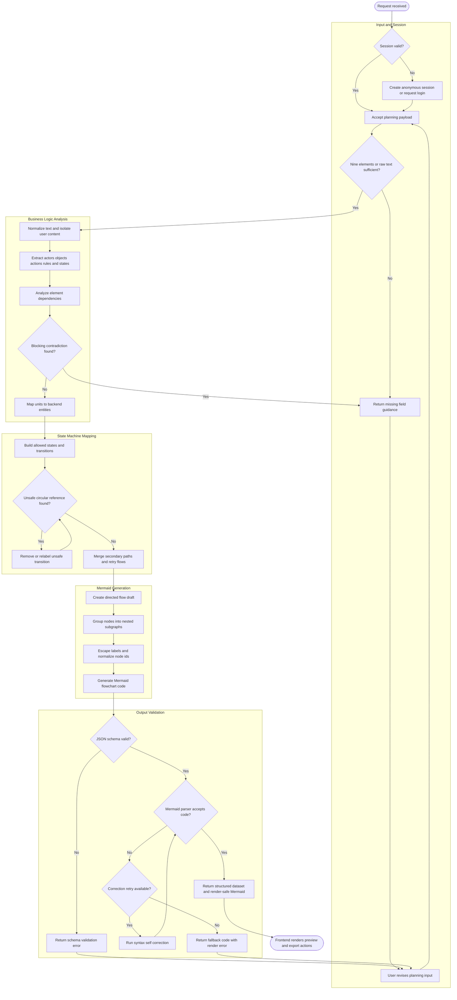

# Backend Orchestration and Mermaid Generation PRD

## Problem Statement

The current AI User Flow Planner MVP validates planning text and generates Mermaid output in the frontend using deterministic TypeScript heuristics. This is useful for a local demo, but it does not yet provide a backend contract for receiving richer planning forms, decomposing ambiguous business logic, maintaining session state, validating generated diagram syntax server-side, or preventing unsafe prompt and diagram generation loops.

Frontend users provide nine rough planning elements such as MVP definition, target user, problem, core scenario, success result, data dependency, exception case, policy constraint, and export need. The backend must convert those unstructured or semi-structured inputs into a normalized planning dataset, map actors, objects, and actions to durable entities, generate state-machine-aware flow logic, and return Mermaid code that is safe to render.

## Evidence

- Existing PRD defines the product promise as converting incomplete MVP notes into logically checked Mermaid user flows with explicit exception paths.
- Existing implementation contains a local schema contract in `src/features/planning/planningSchema.ts` for personas, entities, actions, states, assumptions, suggestions, contradictions, flow drafts, Mermaid documents, and export status.
- Existing renderer already uses Mermaid parse/render validation with one correction attempt in `src/features/planning/mermaidRenderer.ts`.
- Existing graph report identifies core abstractions around `analyzePlanningInput()`, `createMermaidDraft()`, and `correctMermaidSyntax()`, which are the seams likely to move behind an API boundary.
- Assumption: The first backend iteration should preserve the current UI data model so the frontend can switch from local analysis to remote orchestration without a broad redesign.

## Proposed Solution

Build a backend orchestration layer that accepts the frontend planning payload, validates and normalizes it, runs a bounded AI workflow for business logic extraction, maps extracted units to a session-scoped data model, generates a directed Mermaid flowchart with nested subgraphs, validates the output, and returns a structured response compatible with the current UI.

The backend should prioritize correctness over latency. It may use a multi-step LangGraph workflow with self-correction, but every loop must have explicit retry limits, schema validation, and fallback output.

## Key Hypothesis

If backend generation uses structured parsing, state-machine modeling, and Mermaid validation before returning output, then users will receive more complete and render-safe user flows than from a single prompt-to-diagram generation step.

## What We Are NOT Building

- A full collaborative diagram editor.
- Automatic backend code generation from Mermaid diagrams.
- Domain-specific templates tied to one industry.
- Unbounded autonomous agents or recursive prompt loops.
- Persistent enterprise workspaces, billing, or SSO.
- Server-side SVG/PNG export in the first backend phase unless needed for validation parity.

## Success Metrics

- 95% of backend-generated Mermaid documents pass parser validation before response.
- 90% of valid planning inputs include at least one happy path and two secondary or recovery paths.
- 100% of AI outputs pass JSON schema validation before persistence or response.
- 0 unbounded generation loops; all correction flows stop at configured retry limits.
- Frontend can render backend responses without changing the existing readiness, suggestion review, QA handoff, Mermaid output, and export panels.

## Open Questions

- Are the nine planning elements required fields, optional fields, or weighted completeness signals?
- Should anonymous sessions be persisted in Redis only, or also stored in a relational database for history?
- Which LLM provider and model will be used for extraction and Mermaid repair?
- Should RAG retrieval use only internal templates initially, or also user-provided team knowledge?
- Should backend validation call the official Mermaid parser in Node, a service wrapper, or a grammar-level validator before render validation?
- What exact authentication mode is required for MVP: anonymous session token, signed-in account, or both?

## Users & Context

### Primary User: Product Planner

- Provides rough planning elements from a frontend form.
- Needs concrete gaps, secondary paths, and exportable Mermaid code.
- Does not want to debug Mermaid syntax.

### Secondary User: Backend Developer

- Needs a stable request and response contract.
- Needs state transitions, entity mappings, retry limits, and validation errors to be explicit.
- Needs implementation choices that work in FastAPI or NestJS.

### Secondary User: AI Prompt Engineer

- Needs prompts to operate over structured inputs and emit schema-constrained JSON.
- Needs injection-resistant handling of user text and retrieved examples.
- Needs bounded self-correction for Mermaid syntax and logical completeness issues.

## Solution Detail with MoSCoW Priorities

### Must Have

- Accept nine planning elements plus raw freeform text from the frontend.
- Normalize planning input into a versioned `PlanningSession` model.
- Extract Actor, Object, Action, State, BusinessRule, ExceptionPath, and Assumption records.
- Analyze dependencies between the nine planning elements.
- Produce contradiction and insufficiency diagnostics before generation.
- Define a session state machine with authenticated and unauthenticated entry states, processing states, retry states, and terminal states.
- Generate Mermaid flowcharts using nested `subgraph` blocks for input, analysis, review, state transitions, validation, and output.
- Enforce Mermaid-safe node IDs and escaped labels.
- Detect circular references and block unsafe or incoherent loops before returning a diagram.
- Validate generated JSON and Mermaid output before persistence.
- Return API responses aligned with the current frontend schema: completeness, suggestions, QA handoff, flow draft, Mermaid document, and errors.

### Should Have

- RAG retrieval over approved generic flow templates and validation examples.
- Confidence scoring per extracted actor, entity, action, state, and transition.
- Idempotency keys for generation requests.
- Redis-backed session cache for in-progress workflows and correction attempts.
- Audit trail for prompts, model outputs, validation failures, and repaired Mermaid code.

### Could Have

- Sequence diagram generation for API interaction views.
- Backend-rendered SVG preview validation.
- Domain template packs selected by user intent.
- Partial regeneration for one edited node or state transition.

### Won't Have in MVP

- Multi-user collaborative editing.
- Project management integrations.
- Automatic database migration generation from extracted entities.
- Long-term analytics beyond basic generation quality events.

## Data Schema (JSON)

```json
{
  "planningSession": {
    "id": "session_01",
    "version": "2026-04-29",
    "status": "validated",
    "input": {
      "rawText": "User-provided planning text",
      "elements": {
        "mvpDefinition": "What is being built",
        "targetUser": "Who has the problem",
        "problem": "Pain or unmet need",
        "coreScenario": "Primary user journey",
        "successResult": "Expected successful outcome",
        "dataDependency": "External or internal data needed",
        "exceptionCase": "Known failure or edge condition",
        "policyConstraint": "Auth, permission, compliance, or business rule",
        "exportNeed": "Required output format or handoff"
      }
    },
    "dependencyAnalysis": [
      {
        "from": "targetUser",
        "to": "coreScenario",
        "type": "requires",
        "rationale": "A scenario must be owned by at least one actor."
      },
      {
        "from": "dataDependency",
        "to": "exceptionCase",
        "type": "creates_failure_path",
        "rationale": "Data fetch or sync can fail and requires recovery behavior."
      }
    ],
    "entities": {
      "actors": [
        {
          "id": "actor_primary_user",
          "name": "Primary User",
          "sourceElement": "targetUser",
          "confidence": "high"
        }
      ],
      "objects": [
        {
          "id": "object_planning_session",
          "name": "Planning Session",
          "storageTarget": "planning_sessions",
          "confidence": "high"
        },
        {
          "id": "object_mermaid_document",
          "name": "Mermaid Document",
          "storageTarget": "mermaid_documents",
          "confidence": "high"
        }
      ],
      "actions": [
        {
          "id": "action_submit_input",
          "actorId": "actor_primary_user",
          "objectId": "object_planning_session",
          "verb": "submit",
          "preconditions": ["session_available"],
          "postconditions": ["input_received"]
        }
      ]
    },
    "stateMachine": {
      "initialState": "unauthenticated",
      "states": [
        "unauthenticated",
        "authenticated",
        "input_received",
        "parsing",
        "needs_clarification",
        "mapping_logic",
        "generating_mermaid",
        "validating_output",
        "self_correcting",
        "ready",
        "failed"
      ],
      "transitions": [
        {
          "from": "unauthenticated",
          "to": "authenticated",
          "condition": "valid_session_or_login"
        },
        {
          "from": "input_received",
          "to": "parsing",
          "condition": "minimum_fields_present"
        },
        {
          "from": "parsing",
          "to": "needs_clarification",
          "condition": "blocking_contradiction_or_low_completeness"
        },
        {
          "from": "validating_output",
          "to": "self_correcting",
          "condition": "mermaid_parse_failed_and_retry_available"
        },
        {
          "from": "self_correcting",
          "to": "failed",
          "condition": "retry_limit_exceeded"
        }
      ]
    },
    "validation": {
      "jsonSchema": "passed",
      "mermaidSyntax": "passed",
      "cycleCheck": "passed",
      "promptInjectionCheck": "passed",
      "retryCount": 1
    }
  }
}
```

## Entity Relationship Mapping

| Extracted unit | Backend entity | Suggested table or collection | Notes |
|---|---|---|---|
| Actor | `Actor` | `planning_actors` | User, admin, system, AI agent, renderer, external service |
| Object | `PlanningObject` | `planning_objects` | Session, document, dataset, export artifact, integration target |
| Action | `PlanningAction` | `planning_actions` | Verb phrase with actor, object, preconditions, and postconditions |
| State | `SessionState` | `planning_state_transitions` | State machine node and transition condition |
| Rule | `BusinessRule` | `business_rules` | Permission, policy, threshold, and validation constraints |
| Exception | `ExceptionPath` | `exception_paths` | Secondary path with trigger, expected recovery, and QA handoff |
| Mermaid node | `FlowNode` | `flow_nodes` | Stable server-generated ID and escaped label |
| Mermaid edge | `FlowEdge` | `flow_edges` | Directed transition with optional label and cycle metadata |
| Output | `MermaidDocument` | `mermaid_documents` | Code, render status, retry count, validation errors |

## State Machine Design

| State | Description | Allowed next states |
|---|---|---|
| `unauthenticated` | User has no verified session. | `authenticated`, `input_received`, `failed` |
| `authenticated` | User has a valid account or signed session. | `input_received`, `failed` |
| `input_received` | Backend accepted raw text and nine planning elements. | `parsing`, `needs_clarification`, `failed` |
| `parsing` | AI extracts actors, objects, actions, rules, states, and dependencies. | `needs_clarification`, `mapping_logic`, `failed` |
| `needs_clarification` | Input is insufficient or contradictory. | `input_received`, `failed` |
| `mapping_logic` | Backend maps extracted units to entities and transitions. | `generating_mermaid`, `failed` |
| `generating_mermaid` | Backend creates flow draft and Mermaid code. | `validating_output`, `failed` |
| `validating_output` | JSON, graph, cycle, label, and Mermaid syntax checks run. | `ready`, `self_correcting`, `failed` |
| `self_correcting` | Bounded repair prompt or deterministic correction runs. | `validating_output`, `failed` |
| `ready` | Validated Mermaid and structured data are available to the UI. | `input_received` |
| `failed` | Workflow ended with unrecoverable validation or processing error. | `input_received` |

## Flow Logic (Mermaid)



## Mermaid Generation Rules

- Use `flowchart TD` as the default orientation for user flows.
- Generate deterministic node IDs with `[a-z][a-z0-9_]*`.
- Escape double quotes as `&quot;` inside labels.
- Strip or replace Mermaid-sensitive characters from user-provided labels.
- Keep user text in labels only after normalization and length limiting.
- Use subgraphs for logical groups: input, analysis, state machine, generation, validation, output.
- Allow recovery edges only when they point to an earlier safe intake or validation node.
- Block arbitrary user-provided Mermaid directives, raw HTML, script tags, and renderer config overrides.
- Run graph cycle detection and allow only explicitly whitelisted retry cycles with max retry metadata.

## API Endpoint Suggestion

| Method | Endpoint | Purpose | Request summary | Response summary |
|---|---|---|---|---|
| `POST` | `/api/planning-sessions` | Create a session from raw text and nine planning elements. | `rawText`, `elements`, optional `authContext` | `sessionId`, `status`, `completeness`, `missingFields` |
| `POST` | `/api/planning-sessions/{sessionId}/analyze` | Extract actors, objects, actions, dependencies, assumptions, and contradictions. | Optional model config and idempotency key | `PlanningAnalysis` compatible with current frontend schema |
| `PATCH` | `/api/planning-sessions/{sessionId}/suggestions/{suggestionId}` | Accept or reject one logic gap suggestion. | `status: accepted | rejected` | Updated suggestions and QA handoff groups |
| `POST` | `/api/planning-sessions/{sessionId}/state-machine` | Build or rebuild state transitions from accepted logic. | Accepted suggestions and optional clarification answers | `states`, `transitions`, `blockedReasons` |
| `POST` | `/api/planning-sessions/{sessionId}/mermaid` | Generate and validate Mermaid code. | `diagramType`, accepted suggestions, state-machine version | `MermaidDocument`, `FlowDraft`, validation report |
| `POST` | `/api/planning-sessions/{sessionId}/mermaid/validate` | Validate edited Mermaid code without regenerating the full session. | `code` | `renderStatus`, `retryCount`, `renderError`, corrected `code` when applicable |
| `PATCH` | `/api/planning-sessions/{sessionId}/flow-nodes/{nodeId}` | Refine a node label and revalidate affected code. | `label` | Updated `FlowDraft` and `MermaidDocument` |
| `GET` | `/api/planning-sessions/{sessionId}` | Fetch latest session state. | None | Full session snapshot for frontend hydration |

## Technical Approach

### Backend Option A: FastAPI

- Use Pydantic models mirroring the frontend Zod schemas.
- Use LangGraph for staged AI orchestration.
- Use Redis for session cache, idempotency keys, and retry counters.
- Use PostgreSQL later for persisted sessions and audit logs.
- Use a Node Mermaid validation worker if the official Mermaid parser is required server-side.

### Backend Option B: NestJS

- Use Zod or class-validator DTOs aligned with `planningSchema.ts`.
- Use a LangGraph.js workflow if the team wants one TypeScript runtime.
- Use Redis for short-lived sessions and BullMQ for longer generation jobs.
- Use the existing Mermaid package directly for parser validation.

### Recommended First Implementation

Start with NestJS or a TypeScript API route if the frontend remains TypeScript-heavy, because it can reuse Zod schemas and the Mermaid parser with less contract drift. Choose FastAPI only if Python-based LangGraph, model tooling, or RAG infrastructure is the stronger team constraint.

## AI Orchestration Workflow

1. `NormalizeInputNode`: trim, length-limit, classify the nine elements, and isolate user text from system instructions.
2. `CompletenessNode`: score input and return missing field guidance if below threshold.
3. `ExtractionNode`: emit schema-constrained actors, objects, actions, states, rules, and exceptions.
4. `DependencyNode`: build element dependency edges and identify missing prerequisites.
5. `ContradictionNode`: classify contradictions as `warning` or `blocking`.
6. `EntityMappingNode`: map extracted units to backend entities and storage targets.
7. `StateMachineNode`: generate states and transitions with guard conditions.
8. `MermaidDraftNode`: generate typed `FlowDraft` before string serialization.
9. `ValidationNode`: validate JSON schema, graph cycles, label escaping, and Mermaid parser result.
10. `CorrectionNode`: repair only known syntax or graph issues; stop at retry limit.

## Security and Safety

- Treat all planning text as untrusted data.
- Never concatenate user text into system prompts without delimiter isolation.
- Reject user attempts to override system instructions, renderer settings, or API behavior.
- Validate LLM JSON output before storing or using it for Mermaid serialization.
- Store prompt traces without secrets and with user text redaction where needed.
- Use Redis TTLs for anonymous sessions.
- Rate limit generation and validation endpoints by user/session/IP.
- Return user-safe error messages while logging detailed validation context server-side.

## Implementation Phases

| Phase | Status | Scope |
|---|---|---|
| 1. Contract alignment | complete | Define backend DTOs that mirror current `planningSchema.ts`, including nine planning elements and API response envelopes. Report: `.codex/PRPs/reports/backend-orchestration-contract-alignment-report.md`. |
| 2. Deterministic backend validator | complete | Added a standalone NestJS backend app with non-AI completeness, schema validation, Mermaid safety, and parse-only validation endpoints. Report: `.codex/PRPs/reports/backend-orchestration-deterministic-validator-report.md`. |
| 3. AI extraction workflow | pending | Add LangGraph extraction, dependency analysis, contradiction detection, and entity mapping with bounded outputs. |
| 4. State-machine and Mermaid generation | pending | Generate typed flow drafts, nested subgraphs, recovery paths, and render-safe Mermaid code. |
| 5. Persistence and resilience | pending | Add Redis sessions, idempotency, retry counters, audit logs, and rate limiting. |
| 6. Frontend integration | pending | Replace local analysis/generation calls with API-backed calls while preserving current UI panels. |

## Decisions Log

| Date | Decision | Rationale |
|---|---|---|
| 2026-04-29 | Preserve frontend schema compatibility for the first backend PRD. | Current UI already depends on a clear Zod contract and should not be redesigned for backend migration. |
| 2026-04-29 | Generate typed flow drafts before Mermaid strings. | Structured validation is safer than repairing arbitrary Mermaid text. |
| 2026-04-29 | Prefer bounded self-correction over real-time speed. | User priority explicitly favors syntactic correctness and logical completeness over latency. |
| 2026-04-29 | Treat unsafe cycles as validation failures except whitelisted retry paths. | Prevents abnormal loops and renderer-breaking circular logic. |

## Research Summary

- Existing app uses React, Vite, TypeScript, Zod, and Mermaid 11.14.
- Current frontend schema already models analysis results, suggestions, QA handoff, flow drafts, render status, retry count, and export status.
- Current Mermaid serializer already uses subgraphs, escaped labels, typed node shapes, and directed edges.
- Current renderer already performs parse/render validation and deterministic syntax correction.
- Backend design should move these guarantees server-side while adding AI orchestration, state-machine rigor, RAG support, persistence, rate limiting, and prompt-injection defenses.

## Next Step

Use `$prp-plan` with `.codex/PRPs/prds/backend-orchestration-mermaid-generation.prd.md` for the next pending phase.
